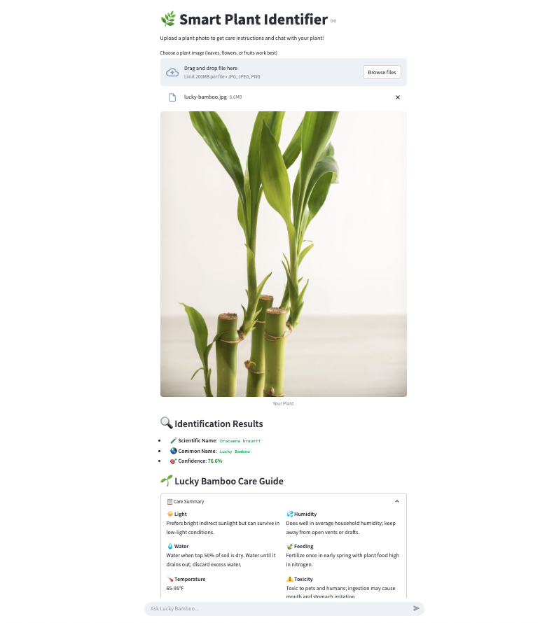
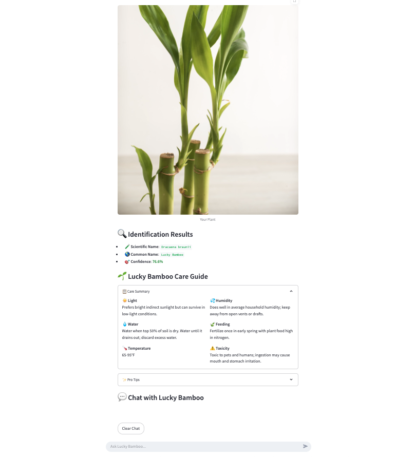

# 🌿 Smart Plant Identifier + Care Companion

Welcome to the **Smart Plant Identifier + Care Companion** — a Streamlit web app that identifies plants using the [PlantNet API](https://my.plantnet.org/) and provides personalized care instructions, complete with personality traits for each plant. It now also supports playful interaction with your plant using an LLM!

---
## 📸 Preview


## 🚀 Features

- 📸 Upload a plant photo and get instant identification.
- 🌱 Scientific and common names with confidence score.
- 💧 Care instructions: lighting, watering, temperature, and more.
- 🧠 Personality profiles: fun traits, plant "stories," and moods.
- 🗣️ Experimental feature: Chat with your plant via LLM integration.

---

## 🛠️ Installation

1. **Clone the repository**
   ```bash
   git clone https://github.com/yourusername/plant-identifier-app.git
   cd plant-identifier-app

2. **Install dependencies**
   ```bash
   pip install -r requirements.txt
   ```
3. **Set up environment variables**
   Create a `.env` file in the root directory and add your API keys:
   ```plaintext
   PLANTNET_API_KEY=your_plantnet_api_key
   OPENAI_API_KEY=your_openai_api_key
   ```
4. **▶️Run the app**
   ```bash
   streamlit run app.py
   ```
5. **📁 File Structure**
    ```
    plant-identifier-app/
    │
    ├── streamlit_app.py                # Main Streamlit app
    ├── api_config.py                   # Your API key (not committed)
    ├── plant_data.py              # Plant data and personality traits
    ├── plant_net.py                  # PlantNet API wrapper 
    ├── plant_care_instructions.json    # Plant care and personality data
    ├── requirements.txt                # Python dependencies
    └── README.md                       # You're here!
    ```
6. **📦 Requirements**
    - `streamlit`
    - `requests`
    - `Pillow`
    - `python-dotenv`
    - `openai`  
7.  **🌟 Future Enhancements**
    **📍 Geo-based recommendations**

    **🪴 AR integration for plant placement**

    **🌤️ Seasonal care tips**

    **🧬 Disease detection**
8. **📜 License**
    MIT License

